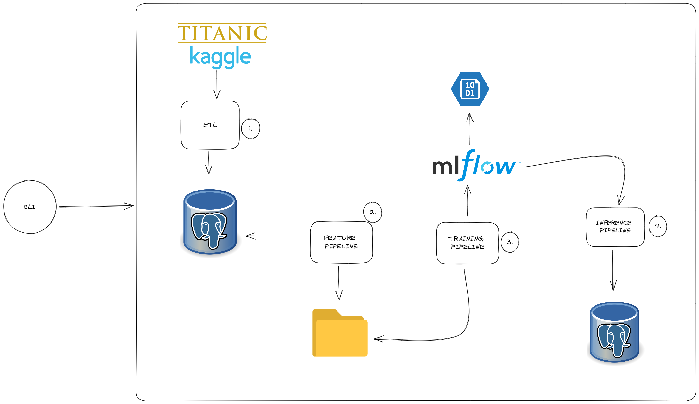
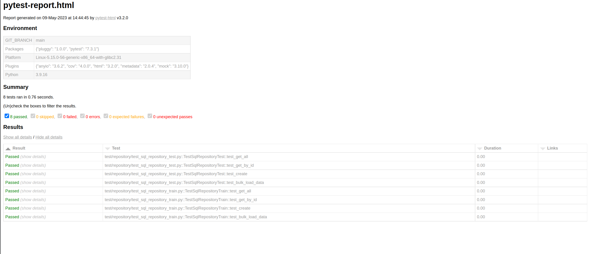
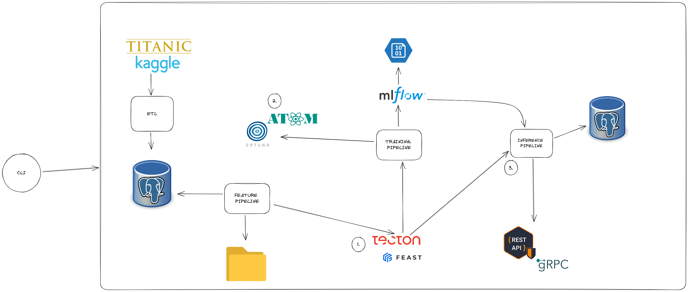

# ML TITANIC

*Este proyecto ha sido realzado con fines netamente exploratorios*

### Instructions

We need you to build a python package with a CLI to train and evaluate a ML model over the famous [Kaggle's Titanic competition](https://www.kaggle.com/competitions/titanic/overview).

### Requirements

- Code should be written using _object oriented programming_.
- Package should have a _command-line interface_ (CLI) to interact with the code.
- Code should be tested and a coverage report should be included.

### Architecture

1. CLI permite crear y destruir las tablas dentro de la base de datos Postgres, así como también el proceso de ETL, el cual se conecta programaticamente usando la API de Kaggle, extrae el dataset y coloca la información dentro de la base PostgreSQL. El módulo de ETL tiene 3 componentes: extractor, quien se conecta a la Api de Kaggle y extrae la información; transforme, quien realiza modificaciones a la información recuperada, y el loader, el cual ingesta la información dentro de la base de datos Postgres.
2. CLI mediante el comando feature ejecuta el feature pipeline, mediante el cual se extrae la información almacenada en la base de datos, realiza el procesamiento a los datos, y almacena la información en una carpeta local.
3. CLI mediante el comando train ejecuta el training pipeline, en el cual selecciona un tipo de modelo a entrenar y configura los hiperparámetros. El training pipeline extrae la información procesada por el feature pipeline, y la usa para entrenar el modelo de ML seleccionado. Se extrae las métricas generadas por este modelo tanto en el dataset de train como el de validation, y son enviadas a MLFlow, el cual tiene un artifact store en Azure Blob Storage.
4. Mediante el CLI se puede también ejecutar el pipeline de inferencia, el cual se conecta a MLFlow y recupera el modelo almacenado, carga el modelo y realiza inferencias sobre el dataset test, que fue proporcionado por la API de Kaggle y almacenada en PostgreSQL. Finalmente estas predicciones sobre el dataset y usando el modelo cargado, son escritas a una base de datos.

### Requirements

- Docker: Los servicios de postgres y mlflow son costruidos usando docker y docker-compose, así que es necesario tenerlo instalado previamente.
- Python: Lenguage que se precisa tener instalado debido a que el proyecto fue desarrollado en este lenguaje.
- Kaggle Account: Se precisa tener una cuenta en Kaggle para poder generar el API Key que nos permitirá conectarnos.
- Azure Account: Se precisa tener una cuenta en Azure para poder generar las credenciales que conectarán a Azure Blob Storage con mlflow.

### Usage

Para desplegar los servcios se debe hacer uso de docker-compose de la siguiente manera, dentro del directorio root del proyecto:

\`make docker `

Para usar los módulos el CLI del proyecto ejecutar el siguiente comando en el directorio root

`pip install --editable .`

Los distintos módulos del proyecto son invocados mediante CLI (Command Line Interface) , el cual se usará de la siguiente manera:

#### ETL Pipeline

`etl`

#### Feature Pipeline

`features`

#### Training Pipeline

`train`

params:
* '- t' : tipo de modelo a entrenar (logistic regression, xgboost classifier, random forest classifier)
* '- hp': path donde se encuentra el archivo de configuración yaml
* '--name': nombre del modelo
#### Inference Pipeline

\`inference\`

params:
* '-modelname': nombre del modelo a recuperar de mlflow

### Test

También se ha realizado un paquete que contiene el unit testing, el cual se lanza de la siguiente manera:

\`make all_tests\`

Esto generará un reporte coverage en formato xml y html

### Model Evaluation

In order to understand what are the main features that affect the output of the model, we need Explainable Machine Learning techniques that unravel some of these aspects.

Para entender cuáles son las principales features que afectan la predicción de nuestro modelo, es preciso recurrir a técnicas de Explanaible ML. Un método ampliamente adoptado para incrementar la transparencia e interpretabilidad de nuestros modelos es SHAP.

SHAP es un método basado en teoría de juego cooperativo: imagine un juego cooperativo donde los jugadores sean las features. Lo que se busca es encontrar la contribución inividual de cada jugador(la feature) sobre el output del modelo.

Para eso se ha creado un notebook analizando e interpretando los modelos creados.

[xgboost_evaluation](https://github.com/reissaavedra/mlops-titanic/blob/main/notebooks/model_evaluation_xgboost.ipynb)

### Limitaciones

- No es el objetivo buscar y/o encontrar el mejor modelo para este dataset.
- Las transformaciones que se hicieron del feature pipeline, fueron basadas en la literatura y ejemplos que puede haber en línea.
- A la fecha, solo se permite entrenar 3 tipos de modelos mediante CLI: Logistic Regression, Random Forest Classifier y XgBoostClassifier.

### Posibles mejoras

1. Se podría implementar un Feature Store como Feast, o Tecton.ai, que permita gestionar, almacenar y servir features dentro de todo el pipeline
2. La utilización de librerías que aceleren el entrenamiento y descubrimiento de nuevos modelos como Optuna, así como la optimización de hiperparámetros como Optuna generaría un gran valor a esta parte del pipeline.
3. La implementación del pipeline de inferencia y su uso por medio de una RestApi o gRPC sería de gran utilidad, permitiendo servir el modelo mediante una implementación de estas interfaces.
